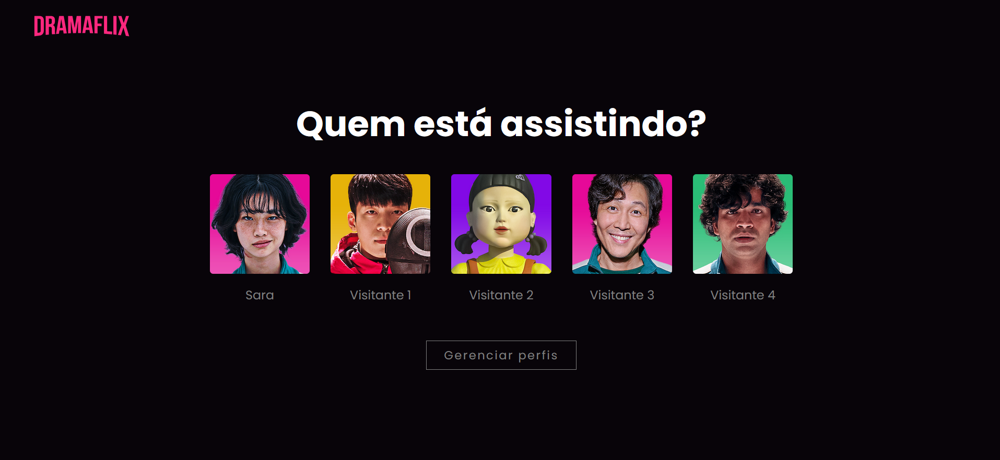
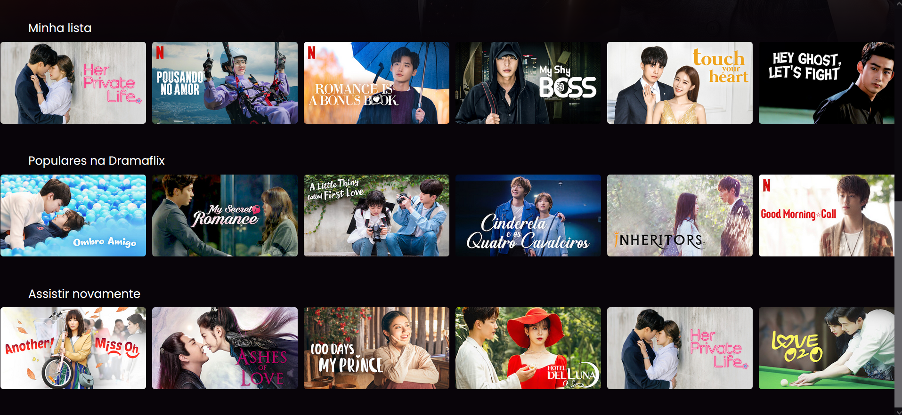

<h1 align="center">
    
</h1>

<h2 align="center"> 
	Dramaflix :clapper:
</h2>

  
  
  

## 💻 Sobre o projeto
O Dramaflix foi criado no desafio do bootcamp da Digital Innovation One, onde a proposta era recriar a interface da Netflix dando uma nova roupagem ao site.
O Dramaflix foca nas séries de TV asiáticas. 

## :camera_flash: ScreenShots

### 🛠 Tecnologias

As seguintes ferramentas foram usadas na construção do projeto:

- [HTML](https://html.spec.whatwg.org/multipage/)
- [CSS](https://www.w3.org/Style/CSS/Overview.en.html)
- [JavaScript](https://developer.mozilla.org/en-US/docs/Web/JavaScript)
- [JQuery](https://jquery.com/)

## 📝 Licença

Este projeto esta sobe a licença MIT.

  
Feito com ❤️ por Sara Cavalcante 👋🏽 Entre em contato!

  
  
   
   

